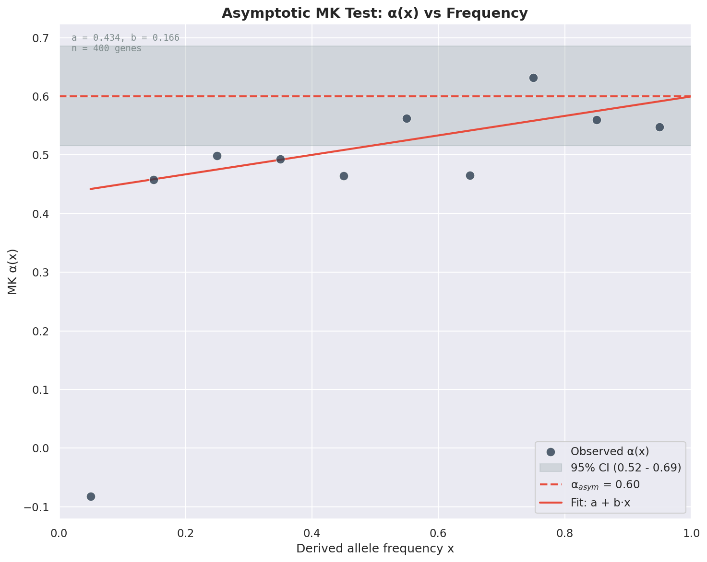
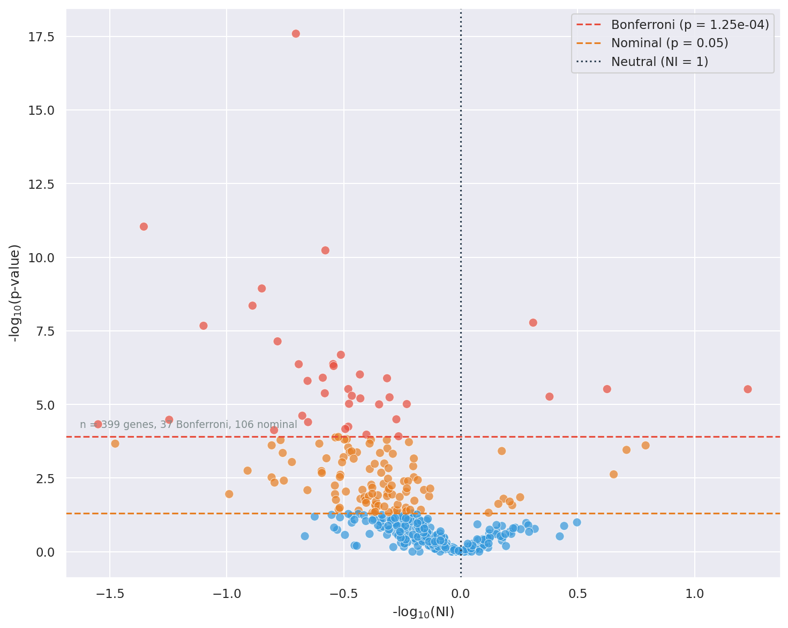

Batch Processing Workflow
=========================

MKado's batch processing mode allows you to analyze multiple genes efficiently, with support for parallel execution and flexible output formats.

.. note::

   If you have a VCF file rather than pre-aligned FASTA, see :doc:`vcf-input` instead. ``mkado vcf`` supports the same analysis modes, plotting, and output formats as ``mkado batch``.

Basic Batch Processing
----------------------

To process all alignment files in a directory:

.. code-block:: bash

   mkado batch alignments/ -i species1 -o species2

This scans for FASTA files (``*.fa``, ``*.fasta``, ``*.fna``) and runs the MK test on each.

Per-gene vs Aggregated Modes
----------------------------

Tests that estimate a single α across many genes (asymptotic MK, imputed MK, Tarone-Greenland α_TG) accept ``--aggregate`` and ``--per-gene``:

- ``--aggregate`` (default for these tests): pool polymorphism and divergence counts across **all** input genes, then fit / compute α once. This is the recommended mode for the asymptotic MK test, where per-gene SFS data are too sparse to fit reliably; it also matches the regime in which asymptotic MK has been validated (see `Murga-Moreno et al. 2022`_).

- ``--per-gene``: run a separate test on each gene and report one α per gene. Useful when you want gene-by-gene point estimates (with the caveat that per-gene asymptotic estimates are noisy).

The standard MK test is naturally per-gene and ignores ``--aggregate``; ``mkado batch`` always reports one row per gene for the standard test, plus aggregated counts in the summary.

.. code-block:: bash

   # Aggregated asymptotic MK (default)
   mkado batch alignments/ -i species1 -o species2 -a

   # Per-gene asymptotic MK (one α per gene)
   mkado batch alignments/ -i species1 -o species2 -a --per-gene

.. _Murga-Moreno et al. 2022: https://doi.org/10.1093/g3journal/jkac206

File Organization
-----------------

Combined File Mode (Recommended)
^^^^^^^^^^^^^^^^^^^^^^^^^^^^^^^^

Each file contains sequences from all species, filtered by name pattern:

.. code-block:: text

   alignments/
   ├── gene1.fa    # Contains species1 and species2 sequences
   ├── gene2.fa
   └── gene3.fa

Usage:

.. code-block:: bash

   mkado batch alignments/ -i "ingroup_pattern" -o "outgroup_pattern"

The ``-i`` and ``-o`` options filter sequences by substring matching in sequence names.

Separate Files Mode
^^^^^^^^^^^^^^^^^^^

Ingroup and outgroup sequences in separate files:

.. code-block:: text

   genes/
   ├── gene1_in.fa   # Ingroup sequences
   ├── gene1_out.fa  # Outgroup sequences
   ├── gene2_in.fa
   └── gene2_out.fa

Usage:

.. code-block:: bash

   mkado batch genes/ --ingroup-pattern "*_in.fa" --outgroup-pattern "*_out.fa"

Asymptotic Batch Analysis
-------------------------

The asymptotic MK test bins polymorphisms by **derived allele frequency** and extrapolates alpha to remove the bias from slightly deleterious mutations. Derived alleles are identified by comparison with the outgroup: alleles shared between ingroup and outgroup are ancestral, and the derived frequency is calculated within the ingroup. See :doc:`tutorial` for details on polarization.

For asymptotic MK tests, you can either:

1. **Aggregate results** (default): Pool polymorphism data across all genes, then fit a single curve
2. **Per-gene analysis**: Run separate asymptotic tests for each gene

Aggregated Analysis
^^^^^^^^^^^^^^^^^^^

.. code-block:: bash

   # Pool data across genes (more statistical power)
   mkado batch alignments/ -i species1 -o species2 -a

This outputs a single asymptotic alpha estimate for the entire gene set.

By default, the 95% CI is computed by sampling parameters from the curve-fit
covariance matrix (parametric Monte Carlo). Pass ``--ci-method bootstrap``
for case-resampling of the pooled polymorphism list — slower per replicate
but more principled for small per-bin counts:

.. code-block:: bash

   # Bootstrap CI (refit per replicate)
   mkado batch alignments/ -i species1 -o species2 -a --ci-method bootstrap

See :doc:`asymptotic` for when to choose each.

Asymptotic Alpha Plot
^^^^^^^^^^^^^^^^^^^^^

When running aggregated asymptotic analysis, you can generate a plot showing how α(x) varies with derived allele frequency, similar to `Messer & Petrov (2013)`_:

.. code-block:: bash

   # Generate alpha(x) vs frequency plot with 20 frequency bins
   mkado batch alignments/ -i species1 -o species2 -a -b 20 --plot-asymptotic alpha_fit.png

The plot shows:

- **Scatter points**: Observed α values at each frequency bin
- **Fitted curve**: Exponential (or linear) fit to the data
- **Horizontal line**: Asymptotic α estimate with 95% confidence interval band

This visualization helps assess the fit quality and understand how slightly deleterious mutations affect α estimates at different frequencies.

   Example asymptotic α(x) plot from the Anopheles batch example data.

Per-Gene Analysis
^^^^^^^^^^^^^^^^^

.. code-block:: bash

   # Separate analysis per gene
   mkado batch alignments/ -i species1 -o species2 -a --per-gene

This outputs asymptotic results for each gene individually.

See :doc:`asymptotic` for full details on the asymptotic methodology, model selection, and interpretation.

Tarone-Greenland Alpha (α_TG)
^^^^^^^^^^^^^^^^^^^^^^^^^^^^^

For a weighted multi-gene estimate that corrects for sample size heterogeneity without frequency spectrum modeling:

.. code-block:: bash

   mkado batch alignments/ -i species1 -o species2 --alpha-tg

See :doc:`alpha-tg` for details on when to use α_TG vs. asymptotic α.

Parallel Processing
-------------------

Use the ``-w`` option to control parallelization:

.. code-block:: bash

   # Auto-detect CPU count
   mkado batch alignments/ -i species1 -o species2 -w 0

   # Use 8 workers
   mkado batch alignments/ -i species1 -o species2 -w 8

   # Sequential processing
   mkado batch alignments/ -i species1 -o species2 -w 1

Output Formats
--------------

Pretty Print (Default)
^^^^^^^^^^^^^^^^^^^^^^

Human-readable table format:

.. code-block:: bash

   mkado batch alignments/ -i species1 -o species2

Tab-Separated Values
^^^^^^^^^^^^^^^^^^^^

For downstream analysis:

.. code-block:: bash

   mkado batch alignments/ -i species1 -o species2 -f tsv > results.tsv

Columns: ``gene``, ``Dn``, ``Ds``, ``Pn``, ``Ps``, ``p_value``, ``p_value_adjusted``, ``NI``, ``alpha``, ``DoS``

JSON
^^^^

For programmatic processing:

.. code-block:: bash

   mkado batch alignments/ -i species1 -o species2 -f json > results.json

The output is a JSON object keyed by gene name, where each gene name is the stem of its
input file. Two input files that share a stem, such as ``gene1.fa`` and ``gene1.fasta``,
therefore produce the same key and are rejected. Rename one input, narrow ``--pattern``,
or use ``-f tsv``, which writes one row per result.

Multiple Testing Correction
---------------------------

When running batch analyses, MKado automatically applies **Benjamini-Hochberg (BH) correction** for multiple testing. This controls the false discovery rate (FDR) when testing many genes simultaneously.

The adjusted p-values are reported alongside the raw Fisher's exact test p-values:

- **p_value**: Raw p-value from Fisher's exact test for each gene
- **p_value_adjusted**: BH-adjusted p-value accounting for multiple comparisons

Example output (TSV format):

.. code-block:: text

   gene        Dn  Ds  Pn  Ps  p_value      p_value_adjusted  NI        alpha
   AGAP000150  12  28  17  18  0.15342      0.288347          2.203704  -1.203704
   AGAP000432  12  59  15  14  0.000904438  0.00556577        5.267857  -4.267857
   AGAP001364  2   19  3   19  1            1                 1.500000  -0.500000

Use ``p_value_adjusted`` when interpreting significance across multiple genes to control for false discoveries.

Volcano Plots
-------------

MKado can generate volcano plots to visualize batch results. Volcano plots show the relationship between effect size (Neutrality Index) and statistical significance across all genes.

.. code-block:: bash

   # Generate a volcano plot
   mkado batch alignments/ -i species1 -o species2 --volcano results.png

   # Save as PDF for publication
   mkado batch alignments/ -i species1 -o species2 --volcano figure.pdf

   # Save as SVG for editing
   mkado batch alignments/ -i species1 -o species2 --volcano figure.svg

Plot Features
^^^^^^^^^^^^^

The volcano plot displays:

- **X-axis**: -log\ :sub:`10`\ (NI) — Neutrality Index transformed to show direction of selection
- **Y-axis**: -log\ :sub:`10`\ (p-value) — Statistical significance
- **Bonferroni threshold line**: Horizontal dashed line indicating the significance threshold after multiple testing correction
- **NI = 1 reference line**: Vertical dotted line at neutral expectation

Interpreting the Plot
^^^^^^^^^^^^^^^^^^^^^

- **Points to the left** (negative X values): NI > 1, excess polymorphism, suggesting segregating weakly deleterious variants
- **Points to the right** (positive X values): NI < 1, excess divergence, suggesting positive selection
- **Points above the threshold line**: Statistically significant after Bonferroni correction
- **Red points**: Genes significant after multiple testing correction
- **Blue points**: Non-significant genes

Example:

.. code-block:: bash

   # Generate volcano plot with example data
   mkado batch examples/anopheles_batch/ -i gamb -o afun --volcano volcano.png

   Example volcano plot from the Anopheles batch example data.

File Filtering
--------------

Customize which files are processed:

.. code-block:: bash

   # Specific pattern
   mkado batch alignments/ -i sp1 -o sp2 --pattern "*.fasta"

   # Multiple extensions (default behavior)
   # Automatically detects *.fa, *.fasta, *.fna

Advanced Options
----------------

Frequency Bins
^^^^^^^^^^^^^^

Customize bin count for asymptotic analysis:

.. code-block:: bash

   mkado batch alignments/ -i sp1 -o sp2 -a -b 20

Reading Frame
^^^^^^^^^^^^^

Specify reading frame for non-standard alignments:

.. code-block:: bash

   mkado batch alignments/ -i sp1 -o sp2 -r 2

Example Workflow
----------------

Here's a complete workflow using the example data:

.. code-block:: bash

   # 1. Check file info
   mkado info examples/anopheles_batch/AGAP000078.fa

   # 2. Run standard batch analysis
   mkado batch examples/anopheles_batch/ -i gamb -o afun

   # 3. Run asymptotic analysis with 20 frequency bins
   mkado batch examples/anopheles_batch/ -i gamb -o afun -a -b 20

   # 4. Export results for downstream analysis
   mkado batch examples/anopheles_batch/ -i gamb -o afun -f tsv > results.tsv

   # 5. Generate a volcano plot for visualization
   mkado batch examples/anopheles_batch/ -i gamb -o afun --volcano results.png

   # 6. Generate asymptotic alpha plot
   mkado batch examples/anopheles_batch/ -i gamb -o afun -a -b 20 --plot-asymptotic asymptotic.png

Exit Status
-----------

``mkado batch`` exits 0 on success, including when no gene produced a result. An
empty result set is a normal outcome: input that cannot be analysed is reported as a
warning and the run still succeeds.

It exits 1 when the run could not proceed, which covers invalid options, missing or
unreadable input files, an input selection that matched nothing, and a result set that
is empty because every gene errored. In that last case the per-gene errors are printed
first and the summary line says every gene failed.

References
----------

.. _Messer & Petrov (2013): https://doi.org/10.1073/pnas.1220835110
